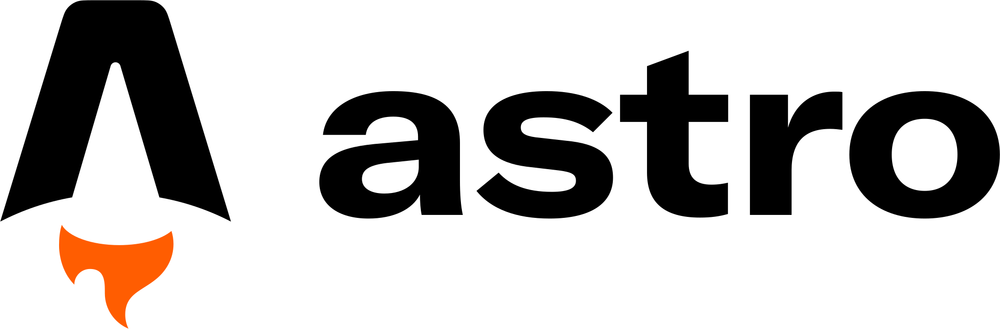

# Building Lightning-Fast Web

  
    Press Space for next page <carbon:arrow-right class="inline"/>
  

  <a href="https://github.com/rossanmol" target="_blank" alt="GitHub"
    class="text-xl slidev-icon-btn opacity-50 !border-none !hover:text-white">
    <carbon-logo-github />
  </a>

<!--
The last comment block of each slide will be treated as slide notes. It will be visible and editable in Presenter Mode along with the slide. [Read more in the docs](https://sli.dev/guide/syntax.html#notes)
-->

---
transition: fade-out
---

# aBouT Me ❤️

	

		
		
Rostislav Dascal

		
@BetssonGroup

	

	

		
		
		
		
		
		
	

---
transition: fade-out
---

# Tech Stack  ❤️

	

		
		
Rostislav Dascal

		
@BetssonGroup

	

	

		
		
		
		
		
		
		
		
		
		
		
		
	

---
layout: default
---

# What is SSR?

---
layout: default
---

# SSR in PHP

---
layout: default
---

# NodeJS introduced in ~2012 (storytelling)

---
layout: default
---

# Hydration

---
layout: default
---

# Partial Hydration

---
layout: default
---

# Server Side Components

---
layout: default
---

# Streaming SSR

---
layout: default
---

# Next-Gen Caching

---
